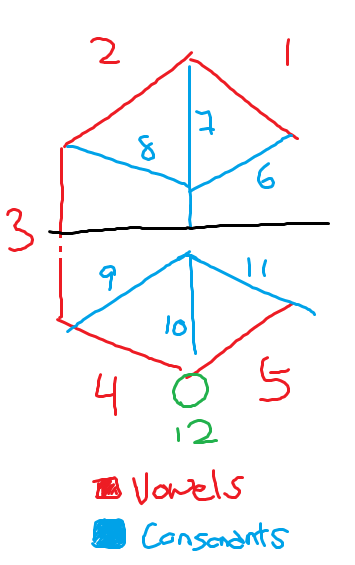

# Tunic translator client

Web client for the API ([source](https://github.com/Yi-Jiahe/tunic_language)).

## Tunic language

The Tunic langauge is a written language, which when read aloud is simply spoken English. As such it is identical to English in terms of grammar and vocab. Understanding the langauge is therefore simply a matter of recognizing the characters.

The characters which are comprised of 12 segments, 5 of which are used to identify a vowel, 6 for a consonant and the 12th used to determine the order of vowel and consonant in a character. Each character represents up to 1 vowel and 1 consonant, and thus, can also represent a single vowel or consonant. Multiple characters make up a word, and charaters in a word are connected by a continous horizontal line through the centre.

Below is a single character and the numbering used to refer to the segments. 

